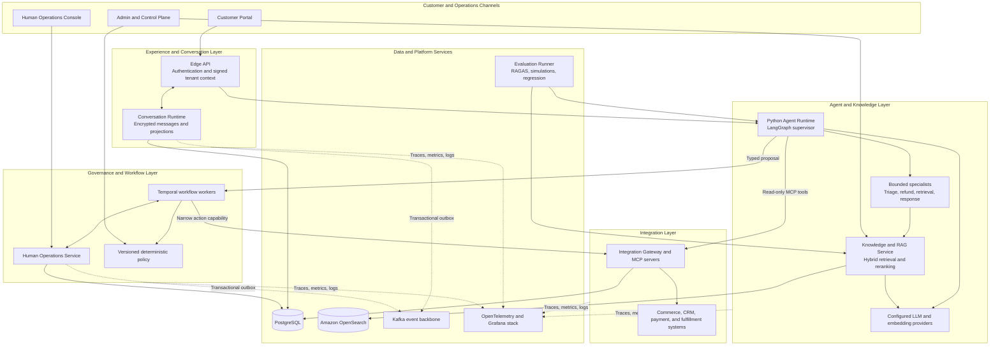
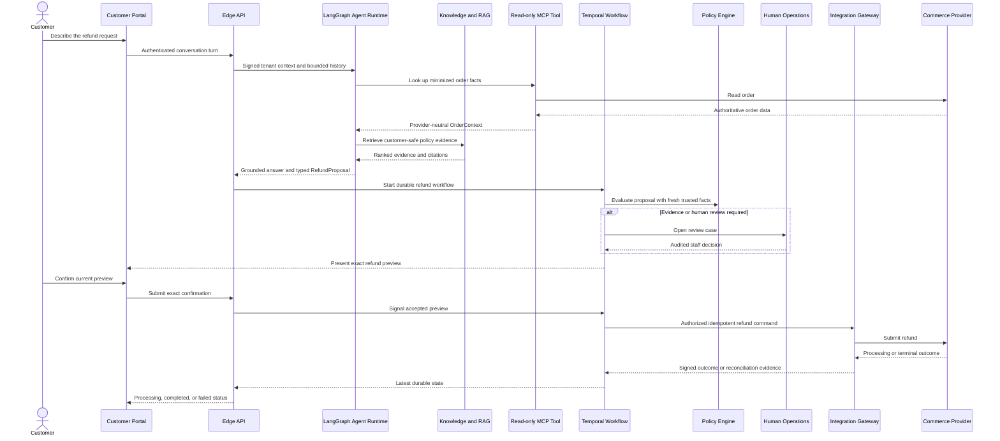

# Customer Service Agent Platform

## Governed customer service agents for retail

Customer Service Agent Platform is a personal engineering project for building,
governing, evaluating, and operating AI customer service agents. It combines
conversational AI with deterministic policy, durable workflows, human review,
retrieval augmented generation, commerce integrations, evaluation, and
observability.

The first end-to-end reference journey is a complex refund workflow. A LangGraph
supervisor coordinates bounded specialists, but the model never receives the
authority to approve or execute a refund. Temporal owns the durable process,
versioned policy determines eligibility, humans review exceptional cases, and an
Integration Gateway controls the final commerce mutation.

## At a glance

- **Supervisor and specialist agents:** LangGraph routes work to bounded refund,
  retrieval, and response specialists.
- **Production-shaped RAG:** versioned knowledge ingestion, hybrid BM25 and vector
  retrieval, metadata filtering, reciprocal rank fusion, cross-encoder reranking,
  and citations.
- **Governed actions:** models return schema-validated proposals; deterministic
  services authorize consequential actions.
- **Durable workflows:** Temporal manages confirmation, human approval, retries,
  provider processing, and reconciliation across restarts.
- **Human operations:** staff can claim cases, review evidence, approve exceptional
  plans, reject requests, and inspect an append-only audit trail.
- **Multi-tenant security:** signed tenant context, audience-scoped assertions,
  least-privilege tools, and isolated knowledge releases.
- **Evaluation and observability:** deterministic graders, RAGAS, repeated trials,
  Tau-bench-style simulations, OpenTelemetry, Prometheus, Tempo, Loki, and Grafana.

## Platform architecture

This view combines the working refund platform with the reusable boundaries for
additional journeys and the target Kafka event backbone.



### Why the boundaries matter

The agent can understand a request, retrieve knowledge, call read-only tools, and
propose a next action. It cannot grant itself permission to mutate a business
system. Trusted services independently verify identity, tenant, current commerce
facts, policy version, customer confirmation, human decisions, and idempotency
before a write crosses the Integration Gateway.

## Governed refund journey



The provider accepting a request does not immediately mean success. The customer
sees **Refund processing** until a signed provider event or authoritative
reconciliation confirms the terminal outcome.

## Customer service journey portfolio

The refund workflow is the reference vertical slice. The same conversation,
identity, retrieval, policy, workflow, integration, human-review, evaluation, and
observability foundations support the broader journey portfolio.

| Journey | Platform behavior |
|---|---|
| Refunds and returns | Eligibility, evidence, refund scope, confirmation, approval, execution, and reconciliation |
| Order status and tracking | Read current fulfillment state, carrier events, expected delivery, and customer-safe updates |
| Cancellation and order changes | Validate fulfillment stage, modification rules, inventory effects, and customer confirmation |
| Damaged, missing, wrong, or delayed delivery | Collect evidence, verify order items, route exceptions, and create replacement or refund plans |
| Exchanges and replacements | Check product eligibility, replacement inventory, price differences, shipping, and approval rules |
| Product and policy questions | Retrieve versioned product, warranty, return, shipping, and care guidance with citations |
| Payment and billing support | Explain payment state, invoices, failed payments, refunds, and provider processing without exposing payment data |
| Account and loyalty support | Handle profile, address, loyalty, subscription, and account-recovery requests through scoped tools |
| Human escalation and takeover | Route sensitive, ambiguous, high-value, or policy-exception cases to the correct staff queue |

## RAG architecture

```mermaid
flowchart LR
    Sources[PDF, DOCX, Markdown, HTML, and database records]
    Registry[Source registry\nclassification and content hash]
    Parse[Structure-aware parsing]
    Chunk[Parent and child chunks\nversioned strategy]
    Embed[OpenAI embeddings]
    Index[Release-scoped OpenSearch index]
    Filter[Mandatory metadata filters]
    Hybrid[BM25 and vector retrieval]
    Fusion[Reciprocal rank fusion]
    Rerank[Cross-encoder reranking]
    Evidence[Citation-ready evidence]

    Sources --> Registry --> Parse --> Chunk --> Embed --> Index
    Index --> Filter --> Hybrid --> Fusion --> Rerank --> Evidence
```



Every indexed chunk carries tenant, environment, knowledge release,
classification, locale, effective dates, document identity, source hash, parser
version, chunking version, and embedding metadata. Customer-facing retrieval is
restricted to `CUSTOMER_SAFE` knowledge before semantic search begins.

## Evaluation strategy

Evaluation is treated as a software engineering discipline, not a single model
score.

1. **Versioned datasets** cover happy paths, missing facts, tool failures, policy
   boundaries, escalation, adversarial input, and recovery paths.
2. **Deterministic graders** check contracts, tool selection, citations, policy
   compliance, tenant isolation, confirmation, and unsafe action attempts.
3. **RAGAS** measures retrieval precision and recall, faithfulness, answer
   relevance, and factual correctness.
4. **Agent simulations** inspect task completion, trajectory, tool use, handoff,
   and final business state across repeated trials.
5. **Regression evaluation** compares compatible prompt, model, policy, knowledge,
   dataset, and grader versions before a release is promoted.
6. **Human calibration** reviews disagreements between deterministic rules,
   semantic judges, and experienced support operators.

### Provisional Tau-bench-style simulation scorecard

> **Illustrative placeholders:** these values are realistic planning numbers for
> the README layout, not measured results or production claims. They will be
> replaced after the official simulation run and human calibration.

| Metric | Provisional value |
|---|---:|
| Simulated retail conversations | 150 |
| End-to-end task completion | 78% |
| Policy compliance | 96% |
| Correct tool selection | 92% |
| Correct human escalation | 90% |
| Retrieval Recall@5 | 93% |
| Grounded-answer pass rate | 88% |
| Unsafe autonomous refund executions | 0 |

## Technology stack

| Layer | Technology |
|---|---|
| Web applications | Next.js, React, TypeScript |
| APIs and transactional services | Node.js, TypeScript, Fastify |
| Agent orchestration | Python, FastAPI, LangGraph, LangChain |
| Knowledge and retrieval | OpenSearch, BM25, vector search, RRF, cross-encoder reranking |
| Durable workflows | Temporal |
| Agent tools and integrations | Model Context Protocol, Vendure, provider-neutral adapters |
| Persistence | PostgreSQL, encrypted conversation storage, transactional outboxes |
| Asynchronous events | Kafka and Amazon MSK architecture |
| Evaluation | RAGAS, deterministic graders, repeated trials, Tau-bench-style simulations |
| Observability | OpenTelemetry, Prometheus, Tempo, Loki, Grafana, CloudWatch architecture |
| AWS deployment target | Single-region ECS Fargate, RDS, OpenSearch Service, Cognito, S3, Secrets Manager, KMS |

## Repository map

```text
apps/web/                  Customer, operations, and administration interfaces
apps/services/             Edge, conversation, agent, RAG, workflow, gateway,
                           human operations, evaluation, and control services
contracts/                 Canonical cross-language schemas and protocol contracts
packages/                  Shared UI, authentication, telemetry, and policy packages
infrastructure/            Local dependencies, observability, and AWS architecture
tools/simulators/          Local commerce system used for integration testing
docs/                      Architecture, decisions, evaluation, verification, and runbooks
```

## Current reference implementation

The refund journey has been exercised locally from customer conversation through
photo evidence review, supervisor approval, exact customer confirmation, one
idempotent Vendure refund, provider settlement simulation, and completed customer
status. The system also includes customer-safe OpenSearch retrieval, RAGAS
adapters, deterministic agent graders, PostgreSQL-backed Human Operations,
signed multi-tenant context, and local OpenTelemetry dashboards.

For precise test evidence and boundaries, see
[Verification Status](docs/VERIFICATION_STATUS.md).

## Explore the project

- [Current HLD and LLD](docs/architecture/KLEEM_AI_ARCHITECTURE_V1_1.md)
- [Combined architecture PDF](docs/reference/architecture/Kleem_AI_Combined_HLD_and_LLD_Architecture.pdf)
- [Project context](docs/PROJECT_CONTEXT.md)
- [Evaluation strategy](docs/evaluation/EVALUATION_STRATEGY.md)
- [Evaluation Runner](apps/services/evaluation-runner/README.md)
- [Observability design and runbook](docs/observability/README.md)
- [Verification evidence](docs/VERIFICATION_STATUS.md)
- [Local refund runbook](docs/LOCAL_REFUND_RUNBOOK.md)
- [Local authentication and secrets](docs/LOCAL_AUTH_AND_SECRETS.md)
- [Architecture decision record](docs/adr/ADR-001-polyglot-runtime-and-mcp-boundaries.md)

## Core engineering principle

> Models propose. Deterministic systems authorize. Durable workflows execute.
> Humans remain accountable for exceptional decisions.
