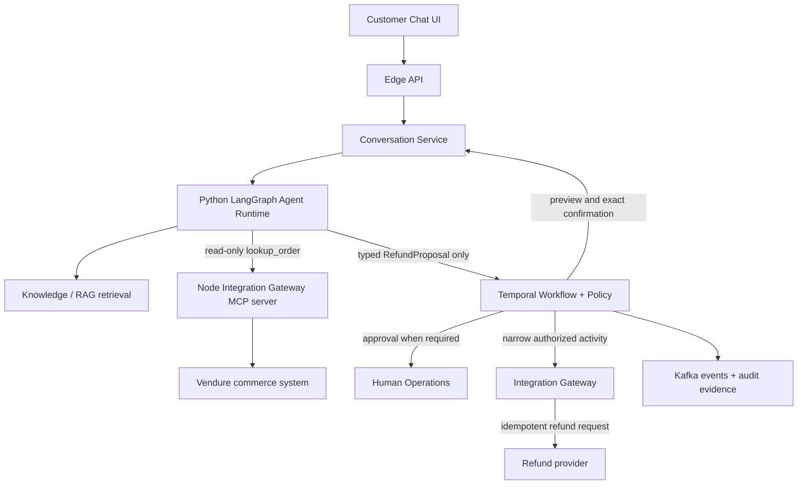

# Customer Service OS Lite: Project Context and Contributor Handoff

Last updated: 2026-07-27
Repository: <https://github.com/chaitanya-y/customer-service-OS-lite>
Working branch: `dev`

## 1. Why this file exists

This is the portable context for engineers or AI coding agents joining the project.
Read it before changing code. It records:

- the product goal and first end-to-end journey;
- the accepted architecture and safety boundaries;
- what has already been implemented;
- what is committed versus only present in the owner's local working tree;
- how to install, run, and test the current components;
- the next recommended implementation steps;
- the working agreements for making changes.

No credentials or `.env` values belong in this file or in Git.

## 2. Product goal

Customer Service OS Lite is a resume-quality, production-shaped customer-service
platform. The learning goal is to build one complex customer journey end to end,
understand every major concept, test it locally, and then deploy a single-region
version to AWS.

The first journey is a refund journey. It is intentionally selected because it
crosses the important system boundaries:

- customer conversation;
- LangGraph orchestration and bounded specialists;
- RAG with citations;
- read-only MCP tools;
- a real commerce integration through local Vendure;
- deterministic policy and policy versions;
- Temporal durable workflow;
- Kafka events;
- customer confirmation;
- human approval and handoff;
- audit evidence, observability, and evaluation;
- frontend and backend APIs.

The immediate objective is not large-scale infrastructure. It is one correct,
traceable, locally testable journey. AWS comes after the local vertical slice and
will initially be single-region.

## 3. Principal architecture decisions

The accepted decision record is:

- `docs/adr/ADR-001-polyglot-runtime-and-mcp-boundaries.md`

The repository uses seven release and ownership boundaries. A boundary may contain
more than one logical application, and multiple boundaries may initially be
deployed together to keep the first version practical.

| Release boundary | Language | Responsibility |
|---|---|---|
| Edge/API | React + TypeScript and Node.js + TypeScript | Customer UI, authentication, trusted tenant context, validation, rate limiting, routing, SSE |
| Conversation Runtime | Node.js + TypeScript | Conversations, messages, ordering, persistence, projections, and event delivery |
| Agent Runtime | Python | LangGraph, bounded specialists, context construction, model orchestration, retrieval, and typed proposals |
| Workflow Workers | Node.js + TypeScript | Temporal workflow, deterministic policy, preview, confirmation, approval, retries, and reconciliation |
| Integration Gateway | Node.js + TypeScript | Commerce connectors, MCP servers, authorization, idempotency, action safety, and audit |
| Human Operations | React + TypeScript and Node.js + TypeScript | Escalation queues, approvals, takeover, review, and release-back |
| Control and Knowledge | React + TypeScript, Node.js + TypeScript, and Python | Admin, tenant config, prompt/model/policy/knowledge releases, RAG ingestion, evaluations, and red-team datasets |

The three browser surfaces are:

- `surfaces/customer-widget`
- `surfaces/operations-console`
- `surfaces/admin-console`

### Refund journey data flow



## 4. Non-negotiable safety and governance rules

1. The LLM never decides authorization, identity, or refund eligibility.
2. Agent-accessible MCP tools are read-only.
3. The refund write operation is never exposed to the Agent Runtime.
4. The Agent Runtime returns a schema-validated `RefundProposal`; it does not
   execute a refund.
5. Workflow Workers re-read authoritative commerce facts before a consequential
   action.
6. Eligibility and approval are deterministic, versioned policy decisions.
7. The canonical preview, applicable policy version, and exact customer
   confirmation are bound together. Material changes require a new preview and
   confirmation.
8. An authorized Temporal activity calls the Integration Gateway with a narrow,
   opaque, expiring action capability.
9. Refund execution is idempotent. Ambiguous provider outcomes go to
   reconciliation or human review; they are never reported as successful.
10. Trusted tenant context is created and signed by the trusted edge, not supplied
    or altered by the model.
11. Each applicable turn/action records `ExecutionEvidence`: prompt, knowledge,
    model route, policy, tool contract, workflow, and evaluation versions.
12. Cross-language boundaries are schema-first. Do not create competing handwritten
    Python and TypeScript contract definitions without a canonical schema.
13. Sensitive commerce data is projected down to the minimum data required by the
    agent. Customer name, email, and payment transaction reference are currently
    removed from the order context.

## 5. Important concepts already introduced

### Trusted tenant context

`TenantContext` identifies the tenant, actor, scopes, conversation, region, and
correlation data for a request. It is trusted metadata carried between services.
It must be signed or otherwise integrity-protected by the edge. The model may read
an allowed projection, but it cannot create or modify the authoritative context.

Canonical contract:

- `contracts/internal-api/proto/customer_service_os/context/v1/trusted_tenant_context.proto`

Tenant-context propagation and enforcement are designed but not implemented yet.

### Order context

The Integration Gateway converts a provider-specific Vendure order into a small,
provider-neutral `OrderContext`. The agent therefore does not depend on Vendure's
GraphQL response shape.

Canonical contract:

- `contracts/tools/order-context/v1/order-context.schema.json`

### `factsVersion`

`factsVersion` is a SHA-256 fingerprint of the normalized authoritative order
facts. It is not a second database and does not prove that a refund occurred. It
allows the workflow to detect that eligibility-relevant facts changed between
proposal, preview, confirmation, and execution.

The provider remains the source of truth. After a write, the system must query the
provider to confirm the outcome.

### Execution evidence

Execution evidence records exactly which behavior and data releases affected a
turn or action. It makes incidents and evaluations reproducible and supports
governance without putting business decisions inside the LLM.

Canonical contract:

- `contracts/ai-io/execution-evidence/v1/execution-evidence.schema.json`

## 6. Repository map

```text
contracts/
  ai-io/                 AI inputs/outputs and execution evidence
  internal-api/          trusted internal protobuf contracts
  tools/                 MCP/tool contracts
  workflows/             proposal and policy decision contracts
deployables/
  agent-runtime/         Python FastAPI + LangGraph
  control-knowledge/     planned control plane, RAG, and evaluation workloads
  conversation-runtime/ planned conversation service
  edge-api/              planned edge API
  human-operations/      planned human operations service
  integration-gateway/  Node/Fastify Vendure adapter, REST projection, MCP server
  workflow-workers/      planned Temporal workflow and policy service
surfaces/
  customer-widget/       planned customer UI
  operations-console/    planned human-agent console
  admin-console/         planned administration UI
tests/contract/          cross-boundary JSON contract tests
tools/simulators/
  commerce-sandbox/      local Vendure commerce system
docs/adr/                architecture decisions
infra/                   future local/AWS infrastructure
```

Empty planned directories are intentional architecture boundaries, not completed
services.

## 7. What is implemented

### Canonical contracts

The repository contains schemas for:

- trusted tenant context;
- execution evidence;
- provider-neutral order context;
- refund proposal;
- policy decision.

The root test suite validates JSON examples and lints the protobuf contract.

### Integration Gateway: committed and pushed

The Node.js/TypeScript Integration Gateway contains:

- a Vendure Admin GraphQL client;
- a provider-neutral `CommerceOrder`;
- the safe `OrderContext` projection;
- a `getOrderContext` use case;
- `GET /v1/orders/:orderReference`;
- a stateless MCP Streamable HTTP endpoint at `POST /mcp`;
- the read-only MCP tool `lookup_order`;
- validation and stable error responses;
- unit/integration tests.

The MCP tool accepts only `orderReference`. Its annotations declare that it is
read-only, non-destructive, idempotent, and open-world.

### Agent Runtime: implemented locally, not yet committed

The current owner working tree also contains:

- strict Pydantic models for `OrderContext`;
- an `OrderLookup` protocol;
- an asynchronous `McpOrderLookupClient`;
- stable mappings for not found, provider unavailable, and invalid tool output;
- dependency injection through `build_refund_graph(order_lookup)`;
- an async LangGraph `lookup_order` node;
- refund graph statuses:
  - `awaiting_order_reference`
  - `order_context_loaded`
  - `order_not_found`
  - `order_lookup_unavailable`
- fake-client tests for graph behavior;
- an API test fixture and MCP client tests.

This local work is not visible to a fresh clone until it is committed and pushed.

## 8. Current Git state

At the time of this handoff:

- branch: `dev`
- remote: `origin`
- remote URL: `https://github.com/chaitanya-y/customer-service-OS-lite.git`
- latest pushed commit: `0542166 feat: add read-only order lookup MCP tool`
- `origin/dev` contains the contracts and Node MCP/order lookup slice.

Local tracked modifications:

```text
deployables/agent-runtime/agent_runtime/refund/graph.py
deployables/agent-runtime/agent_runtime/refund/router.py
deployables/agent-runtime/agent_runtime/refund/schemas.py
deployables/agent-runtime/agent_runtime/refund/state.py
deployables/agent-runtime/pyproject.toml
deployables/agent-runtime/tests/test_refund_api.py
deployables/agent-runtime/tests/test_refund_graph.py
deployables/agent-runtime/uv.lock
```

Local untracked additions:

```text
deployables/agent-runtime/agent_runtime/integrations/__init__.py
deployables/agent-runtime/agent_runtime/integrations/order_lookup.py
deployables/agent-runtime/tests/conftest.py
deployables/agent-runtime/tests/test_order_lookup.py
```

Do not overwrite or discard these changes. Review, test, commit, and push them
before asking collaborators to depend on the Python MCP integration.

## 9. Prerequisites

Use these major versions:

- Git
- Node.js 24.x
- pnpm 11.9.0
- Python 3.12.x
- `uv`

Node 20.11 previously failed while starting the Vendure/Vite development stack.
Use Node 24 for this repository.

The Agent Runtime currently constrains Python to `>=3.12,<3.13`.

## 10. Clone and install

```bash
git clone https://github.com/chaitanya-y/customer-service-OS-lite.git
cd customer-service-OS-lite
git switch dev
```

Install the root Node workspace:

```bash
corepack enable
corepack prepare pnpm@11.9.0 --activate
pnpm install
```

If Corepack is unavailable, install the pinned pnpm version using the normal
package-management policy for your machine.

Install the Vendure simulator separately because `tools/simulators` is not part of
the root pnpm workspace:

```bash
cd tools/simulators/commerce-sandbox
pnpm install
cd ../../..
```

Install the Python Agent Runtime:

```bash
cd deployables/agent-runtime
uv sync --dev
cd ../..
```

## 11. Local environment files

`.env` files are intentionally ignored. Create them locally and exchange real
credentials only through an approved secret channel.

`tools/simulators/commerce-sandbox/.env` needs:

```dotenv
APP_ENV=dev
PORT=3001
COOKIE_SECRET=<local-random-secret>
SUPERADMIN_USERNAME=<local-admin-username>
SUPERADMIN_PASSWORD=<local-admin-password>
```

`deployables/integration-gateway/.env` needs:

```dotenv
PORT=3002
VENDURE_ADMIN_API_URL=http://127.0.0.1:3001/admin-api
VENDURE_API_KEY=<api-key-created-in-vendure>
```

Never commit either file.

### Fresh-clone Vendure limitation

`tools/simulators/commerce-sandbox/vendure.sqlite` is ignored, as it should be, and
the current repository does not yet include a committed initial migration and seed
workflow. Therefore:

- a fresh clone does not contain the owner's products, customers, API key, or test
  orders;
- the sample order reference in this document will not exist in another clone;
- local unit and contract tests can still run;
- reproducible Vendure bootstrap is a known onboarding task that should be added
  before claiming one-command end-to-end setup.

Until that task is completed, a collaborator must initialize their own Vendure
database, create an API key with the necessary read permissions, and create/fulfill
a local order through the Vendure Dashboard.

## 12. Start the local stack

Use separate terminals and start dependencies from the bottom up.

### Terminal 1: Vendure

```bash
cd tools/simulators/commerce-sandbox
pnpm dev
```

Expected local URLs:

- Vendure health: `http://127.0.0.1:3001/health`
- Shop API: `http://127.0.0.1:3001/shop-api`
- Admin API: `http://127.0.0.1:3001/admin-api`
- Dashboard route: `http://127.0.0.1:3001/dashboard`
- Vite Dashboard during development: `http://127.0.0.1:5173/dashboard`

The Vendure worker does not expose an HTTP port.

### Terminal 2: Integration Gateway

```bash
cd deployables/integration-gateway
pnpm dev
```

Expected URLs:

- health: `http://127.0.0.1:3002/health`
- safe order REST projection:
  `http://127.0.0.1:3002/v1/orders/<ORDER_REFERENCE>`
- MCP Streamable HTTP endpoint: `http://127.0.0.1:3002/mcp`

### Terminal 3: Agent Runtime

This requires the local uncommitted Python MCP work described above.

```bash
cd deployables/agent-runtime
uv run uvicorn agent_runtime.main:app --reload --host 127.0.0.1 --port 8000
```

Expected URLs:

- health: `http://127.0.0.1:8000/health`
- refund intake: `POST http://127.0.0.1:8000/refunds/intake`

Example:

```bash
curl -sS http://127.0.0.1:8000/refunds/intake \
  -H 'content-type: application/json' \
  -d '{
    "customer_message": "I want a refund for my order",
    "order_reference": "<ORDER_REFERENCE>"
  }'
```

Expected graph status for a real order is `order_context_loaded`.

## 13. Test commands

Run contract tests from the repository root:

```bash
pnpm check:contracts
```

Last verified result: 12 contract tests passed and Buf lint passed.

Run the Integration Gateway checks:

```bash
cd deployables/integration-gateway
pnpm typecheck
pnpm test
```

Last verified result: TypeScript passed and 14 tests passed.

Run the Agent Runtime checks:

```bash
cd deployables/agent-runtime
uv run ruff check .
uv run ruff format --check .
uv run pytest
```

Last verified result with the local MCP integration: Ruff passed and 11 tests
passed. There was one existing FastAPI/httpx deprecation warning, not a test
failure.

Useful focused test commands:

```bash
# Python MCP client only
uv run pytest tests/test_order_lookup.py -v

# Python refund graph only
uv run pytest tests/test_refund_graph.py -v

# Gateway MCP behavior only
cd ../integration-gateway
pnpm test -- tests/mcp.test.ts
```

## 14. Last real local end-to-end proof

The current owner environment successfully executed:

```text
Python LangGraph
  -> Python MCP client
  -> Node MCP server
  -> Integration Gateway
  -> Vendure Admin API
  -> safe OrderContext
  -> LangGraph status order_context_loaded
```

The local test order was:

- order reference: `AVV8JSZH8G6ZZDMX`
- order state: `Delivered`
- amount: `168880` minor units, `USD`
- payment: `Settled`
- fulfillment: `Delivered`
- shipping method: `Test Courier`
- tracking code: `TEST-TRACK-001`
- facts version:
  `sha256:d25c3a2180202ce1cbb40d6d24f2ce6f17ba648fd7c9b556387105458da69be9`

This is evidence from one local database, not portable seed data. The safe
projection did not expose customer name, email, or payment transaction reference.

## 15. What is not built yet

Do not mistake directory names or schemas for completed functionality. These major
parts remain:

- trusted tenant-context creation, propagation, verification, and authorization;
- Conversation Service and persistent conversation model;
- Edge API, authentication, streaming, and rate limiting;
- customer chat UI;
- RAG ingestion, versioned knowledge releases, hybrid retrieval, reranking, and
  citations;
- triage and refund specialists driven by an LLM;
- typed `RefundProposal` generation from the Agent Runtime;
- Temporal refund workflow and replay-safe versioning;
- deterministic versioned refund policy implementation;
- canonical refund preview and exact customer confirmation;
- human approval, escalation queue, and takeover console;
- authorized/idempotent refund execution;
- Kafka topics, event schemas, consumers, and outbox delivery;
- OpenTelemetry traces, metrics, logs, and audit projections;
- evaluation datasets, trajectory/tool/policy/safety evaluations, and gates;
- admin/control plane for version publication;
- reproducible Vendure migration/seed/bootstrap;
- local container orchestration;
- AWS single-region infrastructure and deployment.

## 16. Recommended next sequence

The shortest safe path to the first vertical slice is:

1. Review, run, commit, and push the current Python MCP/LangGraph order lookup
   changes.
2. Add reproducible Vendure initialization and seed data so another clone can run
   the same end-to-end lookup.
3. Implement trusted tenant context at the Edge/API boundary and propagate it
   through Agent Runtime to Integration Gateway. Enforce tenant-scoped order
   access.
4. Add the first versioned refund policy and policy decision contract execution.
5. Make the Agent Runtime produce a schema-validated `RefundProposal`.
6. Implement the minimal Temporal workflow:
   facts refresh -> policy -> preview -> confirmation -> optional approval ->
   authorized action -> provider confirmation.
7. Add human handoff for policy-required approval and ambiguous provider outcomes.
8. Add Kafka event publication through an outbox for journey/audit projections.
9. Add the first small versioned refund-policy knowledge corpus and RAG citations.
10. Add traces and a compact evaluation dataset before deploying the single-region
    AWS slice.

Do not start by building every empty service. Extend the walking refund slice and
add a boundary only when the journey reaches it.

## 17. Working agreement for contributors and coding agents

Before writing application code:

1. Read this file and the accepted ADR.
2. Inspect the relevant canonical schema and existing tests.
3. Explain the proposed behavior in simple language.
4. List the exact files that would be created or changed.
5. Ask the repository owner for explicit permission through the available approval
   prompt before editing application code.
6. Call out any important architectural or security concept before proceeding.

While implementing:

- prefer the smallest complete vertical change;
- avoid speculative abstractions, placeholder services, and duplicated DTOs;
- use dependency injection at external boundaries;
- keep model outputs typed and untrusted;
- keep business rules deterministic;
- add focused tests with each behavior;
- preserve unrelated working-tree changes;
- explain the call flow and what the owner should observe after each step.

Before handing off:

- run the relevant linter, type checker, and tests;
- report what passed and what was not run;
- distinguish committed work from local work;
- never claim a provider write succeeded without authoritative confirmation;
- never include secrets in logs, screenshots, fixtures, documentation, or commits.

## 18. Immediate handoff warning

This context document itself and the Python MCP/LangGraph integration must be
committed and pushed to `dev` before a normal `git clone` can retrieve them.
Until that happens, share this file directly and tell collaborators that
`origin/dev` currently ends at commit `0542166`.
